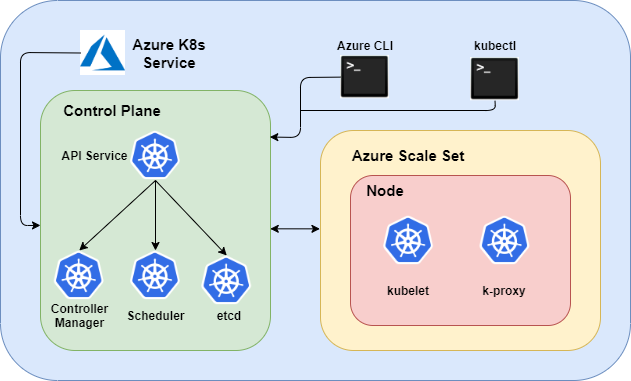
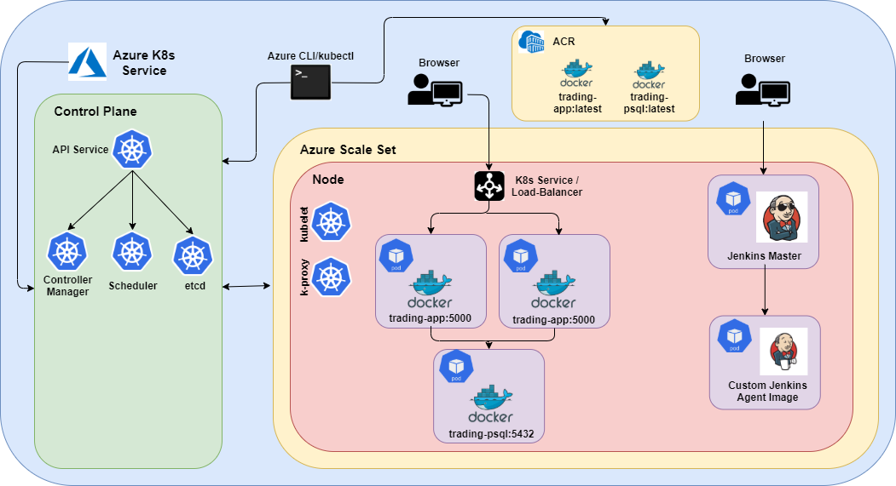
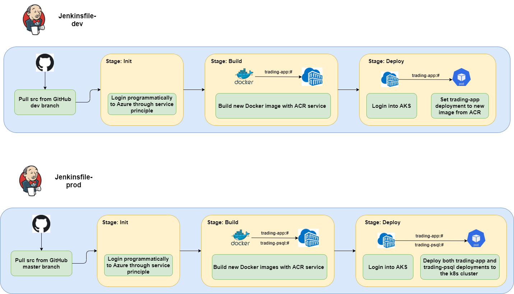

# DevOps Project

## Introduction
The Jarvis organization is moving from on-premise servers to the 
Microsoft Azure cloud; this is a PoC to re-assure such a decision.
The project uses Azure APIs to deploy the
[SpringBoot App](https://github.com/jarviscanada/jarvis_data_eng_AndresOsorio/tree/master/springboot)
to Kubernetes clusters managed by Azure. Migrating to the cloud has the following benefits:
- Easy to scale up or down
- High Availability
- Fault Tolerance
- Replacing Capital Expenditure by Operational Expenditure
    (paying only for what you use)
- Continuous Integration / Deployment

Through the Azure Kubernetes Service, I created 2 Kubernetes
clusters, which serve as separate environments: 
- The development environment is meant for Continuous Integration
    (testing, rolling updates)
- The production environment is meant for Continuous Deployment
    (deploying the latest product to customers continuously)

I developed a CI/CD pipeline for each of the environments using Jenkins:
- The pipeline in the development environment tracks the develop branch
    from the remote repo of the project;
    it creates a new SpringBoot app image using
    the Azure Container Registry to capture any changes to the source code
    and updates the Kubernetes deployment
    to contain the new image (assumes app is already deployed)
- The pipeline in the production environment tracks the master branch
    from the remote repo of the project; it builds/re-builds both the
    PostgreSQL and SpringBoot images using the Azure Container Registry
    and deploys them to the Kubernetes cluster

## Application Architecture
Each of the Kubernetes clusters (environments) are exactly the same:
they are created using the Azure Kubernetes Service with Azure scale
sets (one node). The app is deployed to the one node of the clusters, 
scaled up or down as needed, and exposed to the outside world through
Kubernetes services/load-balancer. The Azure Kubernetes Service controls
the Kubernetes control plane and I interacted with it through the
`Azure CLI` and `kubectl`. The continuous integration and deployment 
process was automated through Jenkins, which works as a deployment
itself on the clusters.

### Kubernetes Deployments

### Application Architecture

## Jenkins CI/CD pipeline
Development environment CI/CD pipeline:
- Fetches source code from the develop branch of remote repository
- Builds a new SpringBoot app image using the Azure Container Registry
- Updates the image of the current deployment in the development
    cluster to the one just created (assumes app is already deployed)

Production environment CI/CD pipeline:
- Fetches source code from the master branch of remote repository
- Builds/re-builds both the PostgreSQL and SpringBoot images using
    the Azure Container Registry
- Deploys both the PostgreSQL and SpringBoot deployments to the
    production cluster

## Improvements
- Use a bigger cluster to test High Availability and Fault Tolerance
- Re-build the project with another managed Kubernetes service
   (GCP, AWS) to compare 
- Explore Kubernetes and Jenkins more in depth to build more
   complicated CI/CD pipelines