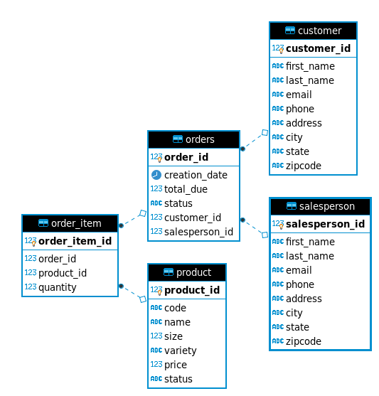

# JDBC App
## Introduction
This app uses a dockerized `PostgreSQL` instance with some filler tables to
introduce basic `JDBC` functionality; fundamental `CRUD` operations are performed
using the `DAO` (Data Access Object) pattern as an abstraction layer with 
`DTOs` (Data Transfer Objects) as the actual objects encapsulating data to and 
from the database. 

## ER Diagram

## Data Access Patterns
Both patterns, `DAO` and `Repository`, are data access patterns;
they are classes or components that encapsulate the logic required to 
access data sources. They centralize common data access functionality,
providing better maintainability and decoupling the infrastructure or 
technology used to access databases from the domain model layer.  
The difference between these patterns is that the 
`Repository` pattern focuses only on single table access per class; the `Repository`
pattern joins tables in code whereas the `DAO` pattern joins them in the actual
database; this means that the `DAO` pattern shines with normalized data and 
vertically-scaling systems because complex joins require a single instance
of the database, whereas the `Repository` pattern is best suited for denormalized
data and horizontally-scaling (distributed) systems because it can access single tables
from different databases and join them in code. However, truly atomic transactions
cannot be accomplished with the `Repository` pattern due to its distributed nature.