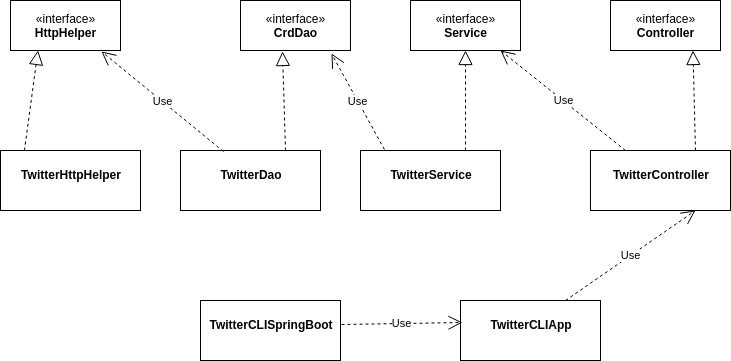

# Twitter CLI App
## Introduction
This is a Java implementation of a CLI app that can post/show/delete
Twitter posts via the Twitter REST API.
TwitterCLIApp is designed with the well known MVC (minus V) 
architecture (design pattern):
- Models are implemented through POJOs and encapsulate the Tweet object
- The data access layer handles models; the app posts/shows/deletes
    Twitter posts using the Data Access Object (DAO) data access pattern
- The service layer handles business logic and calls the DAO layer in order to 
    interact with the underlying storage/service which is the Twitter REST API in this app
- The controller layer interacts and parsers user input (CLI args in this app)

## Usage
```bash
# general usage
TwitterCLIApp post|show|delete [options]

# post usage; long and lat are float numbers indicating coordinates
TwitterCLIApp post "your text" "long:lat"

# show usage
TwitterCLIApp show "tweet_id"

# delete usage
TwitterCLIApp delete "tweet_id1,tweet_id2,..."
```

## Quick Start
Package app using Maven:
```bash
# clean and package (fat jar) app
mvn clean package
```
Run app with docker:
```bash
# pull pre-built docker image
docker pull onehoax/twitter

# run the app:
#   "--rm" removes the container if it already exists 
#   "-e" sets environment variables in the container
#   the environment variables passed are the credentials optained from your developer Twitter account

# post usage
docker run --rm \
    -e consumerKey=$consumerKey \
    -e consumerToken=$consumerSecret \
    -e accessToken=$accessToken \
    -e tokenSecret=$tokenSecret \
    onehoax/twitter post "#tweet text" "45:32"

# show usage
docker run --rm \
    -e consumerKey=$consumerKey \
    -e consumerToken=$consumerSecret \
    -e accessToken=$accessToken \
    -e tokenSecret=$tokenSecret \
    onehoax/twitter show "1276568976764686343"

# delete usage
docker run --rm \
    -e consumerKey=$consumerKey \
    -e consumerToken=$consumerSecret \
    -e accessToken=$accessToken \
    -e tokenSecret=$tokenSecret \
    onehoax/twitter delete "1276568976764686343,1200145224103841792"
```

## Design
UML Diagram:  


- The data access layer handles models; the app posts/shows/deletes
    Twitter posts using the Data Access Object (DAO) data access pattern
- The service layer handles business logic and calls the DAO layer in order to 
    interact with the underlying storage/service which is the Twitter REST API in this app
- The controller layer interacts and parsers user input (CLI args in this app)
- The app/main layer (entry point) initializes all components (and their dependencies)
    and runs the app with the given user input

## Models
This app uses a simplified version of the Tweet object:
- `created_at: String` 
- `id: long`
- `id_str: String`
- `text: String`
- `entities: Entity`
- `coordinates: Coordinates`
- `retweet_count: int`
- `favorite_count: int`
- `favorited: boolean`
- `retweeted: boolean`

The member variables `entities` and `coordinates` are objects themselves;
the Entity object is made up of `hastags` and `user_mentions`, which are
also objects.

Simplified Tweet object in JSON:

```json
{
   "created_at":"Mon Feb 18 21:24:39 +0000 2019",
   "id":1097607853932564480,
   "id_str":"1097607853932564480",
   "text":"test with loc223",
   "entities":{
      "hashtags":[],      
      "user_mentions":[]  
   },
   "coordinates":null,    
   "retweet_count":0,
   "favorite_count":0,
   "favorited":false,
   "retweeted":false
}
```

## Spring
The Spring `@ComponnentScan` is used to define dependency relationships;
each dependency of the project is annotated with `@Component` (or one
of its stereotypes: `@Controller`, `@Service`, `@Repository`), which tells
the `IoC container` that the respective class is a `Bean`; the constructor
for each `Bean` is annotated with `@Autowired`, which tells the `IoC container`
to inject that class's dependencies through its constrcutor; finally,
a SpringBoot configuration class is used to tell the `IoC container` 
where to look for `Beans`: the `TwitterCLISpringBoot` class
is annotated with `@SpringBootApplication` (composition of multiple annotations
that helps to configure Spring automatically) and implements the `run()` 
method from the `CommandLineRunner` interface, which replaces 
the main method (entry point of app).

## Docker
The app can be dockerized as follows:
```bash
# clean and package (fat jar) app
mvn clean package

# create docker image from Dockerfile provided (mind the dot)
docker build -t ${your_tag} .
```
The instructions in the Dockerfile copy the `fat .jar` file
generated by Maven to the Docker container and set the entry point
to `java -jar ...jar`, which lets the user run the docker image as
the application without having to specify Java options:   
`docker run [docker options] ${image_tag} [app options]`.

## Improvements
1. Use the complete Tweet object
2. Include more options for posting action
3. Improve unit testing