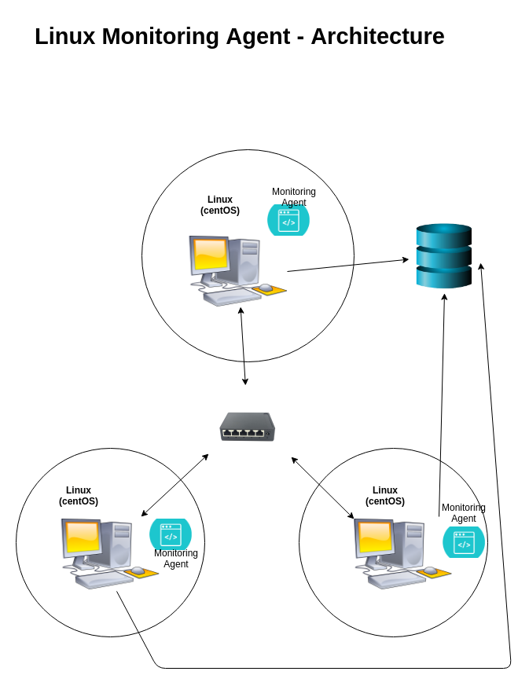

# Linux Monitoring Agent
## Introduction
This Cluster Monitoring Agent is an internal tool that monitors a cluster's
resources and usage across time, which provides the team invaluable information
when it comes to deciding whether to scale the cluster (and each node in it)
up or down. This monitoring agent is installed in each node in the cluster;
it collects resources information once and usage data every minute; all 
the data is persisted in a PSQL instance.

## Quick Start
- Start a psql instance using psql_docker.sh
```bash
# create a psql docker container
./psql_docker create username userpassword
```
- Create tables using ddl.sql
```bash
# to be able to enter the psql server without a password prompt
export PGPASSWORD="userpassword" 

# enter the psql instance
psql -h localhost -U username

# create the host_agent database once in psql cml
CREATE DATABASE host_agent;

# to quit psql cml
\q 

# create the tables
psql -h localhost -d host_agent -f ddl.sql -U username
```
- Insert hardware specs data into the db using host_info.sh
```bash
./host_info.sh localhost 5432 host_agent username userpassword
```
- Insert hardware usage data into the db using host_usage.sh
```bash
./host_usage.sh localhost 5432 host_agent username userpassword
```
- Crontab setup
```bash
# to edit/create cron jobs
crontab -e

# a text editor will open up; enter the following in one line; the path to the script needs to be absolute
* * * * * /absolute/path/to/host_usage.sh localhost 5432 username userpassword
```

## Architecture Diagram


## Database Modeling
The database host_agent consists of 2 tables; host_info stores hardware specs of 
each host, while host_usage stores usage data from each host; the hardware specs are
only collected once (as they are assumed to be static), while the usage data is
collected every minute (since it changes constantly); the tables are linked through their
id and host_id columns ('host_id' in host_usage references 'id' in host_info).

- `host_info`
    - `id`: serial data type; autoincrements with each entry; primary key
    - `hostname`: fully qualified hostname
    - `cpu_number`: number of cores
    - `cpu_architecture`: 32-bit / 64-bit
    - `cpu_model`: model of the cpu
    - `cpu_mhz`: speed of the processor in mhz
    - `L2_cache`: amount of level 2 cache in kB
    - `total_mem`: total memory in kB
    - `timestamp`: current time in UTC timezone

id | hostname | cpu_number | cpu_architecture | cpu_model | cpu_mhz | L2_cache | total_mem | timestamp 
---|----------|------------|------------------|-----------|---------|----------|-----------|----------- 
1  | jrvis-remote..| 2| x85_64 | Intel(R) Xeon(R) CPU @ 2.30GHz | 2300.000 | 256 | 601324 | 2019-05-29 17:49:53
...|...|...|...|...|...|...|...|...|
- `host_usage`
    - `timestamp`: current time in UTC timezone
    - `host_id`: the host id from the host_info table
    - `memory_free`: free memory in MB
    - `cpu_idle`: percentage of cpu that is idle
    - `cpu_kernel`: percentage of cpu that is being used by the kernel
    - `disk_io`: number of current disk I/O processes
    - `disk_available`: root directory available disk in MB

timestamp | host_id | memory_free | cpu_idle | cpu_kernel | disk_io | disk_available
----------|---------|-------------|----------|------------|---------|----------------
2019-05-29 17:49:53 | 1 | 256 | 99 | 0 | 0 | 31220
...|...|...|...|...|...|...|

## Scripts
- [psql_docker.sh](scripts/psql_docker.sh): this script deals with the docker psql container that works
    as the psql server to preserve the data collected; the script can be used to 
    create the container (must provide username and userpassword for this option),
    start it (if it already exists) and stop it
```bash
# usage options
./psql_docker [create | start | stop] [username password]

# usage examples
./psql_docker create username userpassword
./psql_docker start
./psql_docker stop
```
- [host_info.sh](scripts/host_info.sh): this script collects the host's resources information (hardware info)
    and inserts this data into the host_info table in the database; since this script is the
    first one to be called after the container creation, the creation of the database 
    'host_agent' and tables 'host_info' and 'host_usage' is also included in this script
    (before inserting data into the database) to avoid doing those tasks manually
```bash
# usage options
./host_info [hostname portnumber dbname username userpassword]

# usage examples
./host_info localhost 5432 host_agent username userpassword 
```
- [host_usage.sh](scripts/host_usage.sh): this script collects the host's usage data at that point in timne 
    and inserts it into the table host_usage in the database
```bash
# usage options
./host_usage [hostname portnumber dbname username userpassword]

usage examples
./host_usage localhost 5432 host_agent username userpassword
```
- **crontab**: this script creates a new cron job in the cron table; it makes
    the script [host_usage.sh](scripts/host_usage.sh) a cron job to be executed every minute automatically
```bash
# to edit cron jobs - opens up a text editor to enter/edit cron jobs
crontab -e

# enter this in the text editor; each cron job must be in one line; path must be absolute
* * * * * /absolute/path/to/host_usage.sh localhost 5432 host_agent username password 

# list current cron jobs
crontab -l 
```
- [queries.sql](sql/queries.sql): the queries in this file return 3 things from the information collected in the 
    tables host_info and host_usage:
    - group hosts by CPU number and sort by their memory size in descending order(within each cpu_number group)
    - average used memory in percentage over 5 mins interval for each host
    - node failure (over 5-min intervals) 
    
    This data informs how much resources are actually being used by the nodes in the cluster and is
    therefore vital to determining whether to scale up or down to meet usage demand.
```bash
# connect to the psql server and run the sql commands in queries.sql
psql -h localhost -d host_agent -f queires.sql -U username
```

## Improvements 
- **handle hardware update**: run the host_info.sh script every few months or so to capture
    new specs in case hardware is updated 
- **more data insights**: run more queries to get more detailed usage information
    (cpu usage, etc.)
- **multicluster support**: adapt the program to monitor more than one cluster at a time to be able
    to compare not just nodes, but specs and usage data across clusters
