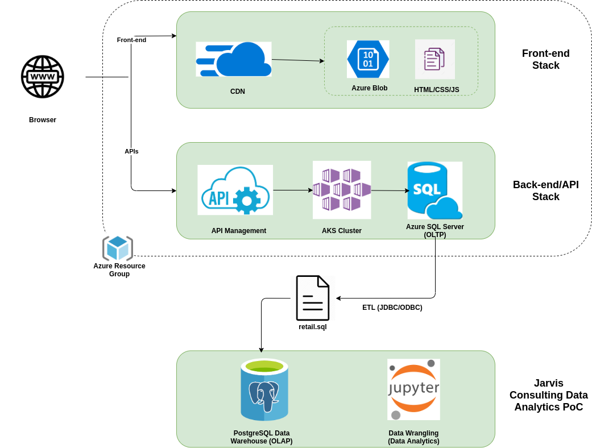
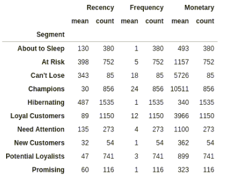

# Data Wrangling

## Introduction
- London Gift Shop (LGS) is a UK-based online store that sells gifts; it has been operating for more than 10 years but revenue has plateaued recently. LGS wants to use the latest data technologies to evaluate their customers and sales data better in order to develop marketing strategies that will drive revenue up again. However, the LGS team does not have the resources to carry out this project, so they turned to Jarvis Consulting to get data engineering and analysis services.  
- I implemented this data analysis PoC (if valuable to LGS, they will invest more); I answered multiple business questions by analyzing LGS sales data from 2009-12 to 2011-12; the LGS IT team dumped the data into a SQL file, which I loaded into a PostgreSQL dockerized instance that served as the data warehouse; I used Numpy, Pandas DataFrame and Jupyter Notebook (all Python technologies) to perform OLAP operations on the data (from data warehouse) and ultimately answer the desired business questions; I also used RFM segmentation for analyzing customer value. 

## Project Architecture
LGS uses a web-app as its online shop; this web-app uses an Azure SQL 
Server as its database for daily OLTP operations; because this project
is a PoC, I am not allowed to work with this database directly; instead, 
the LGS IT team dumped the transaction data between 2009-12 and 2011-12  
into an SQL file, which I then loaded into a data warehouse (PostgreSQL 
instance) and used it to perform OLAP operations using Python technologies.

## Data Analytics and Wrangling
This [Jupyter Notebook](./retail_data_analytics_wrangling.ipynb) presents the data wrangling done on the retail data
provided by LGS to answer the following business questions:
- Total Invoice Amount Distribution
- Monthly Placed and Cancelled Orders
- Monthly Sales
- Monthly Sales Growth
- Monthly Active Users
- Monthly New and Existing Users
- RFM Segmentation

RFM stands for Recency, Frequency, and Monetary; RFM Segmentation 
allows marketers to gain an extensive understanding of their customers by 
analyzing those 3 quantifiable factors; it is a way to analyze customer value.
  

The table below depicts the RFM Segmentation for the LGS retail data provided:

To help LGS drive their revenue back up, I have paid special attention to 3
segments:  
1. Can't Lose
    - Number of customers: 85
    - Last shopping date on average: 343 days ago
    - Average number of purchases: 18
    - Average money spent: &#163;5726
    - Customers in this segment have not recently made a purchase, therefore 
        prepare a discount and gift campaign for this segment. These customers
        have made a large number of purchases in the past, but the recency 
        values are lower than they should be; the strategy for this segment 
        should include recommendations based on previous purchase activity; 
        new and popular products related to products they were interested in
        should also be included in the campaign. Conditions that cause 
        these customers to stop buying need to be investigated.

2. Hibernating
    - Number of customers: 1535
    - Last shopping date on average: 487 days ago
    - Average number of purchases: 1
    - Average money spent: &#163;340
    - Customers in this segment have not made a purchase in a long time;
        however, by offering discounts, they may be attracted to another 
        purchase.

3. Champions
    - Number of customers: 856
    - Last shopping date on average: 30 days ago
    - Average number of purchases: 24
    - Average money spent: &#163;10511
    - Customers in this segment are responsible for most of the revenue;
        campaigns should be implemented to ensure their shopping continuity
        by keeping them happy with perks, discounts, gifts, etc.

## Improvements
- Consider more business questions
- Clean up data a bit more (remove more outliers)
- Explore further functionality of Python Data Analysis libraries
    as it pertains to this project
