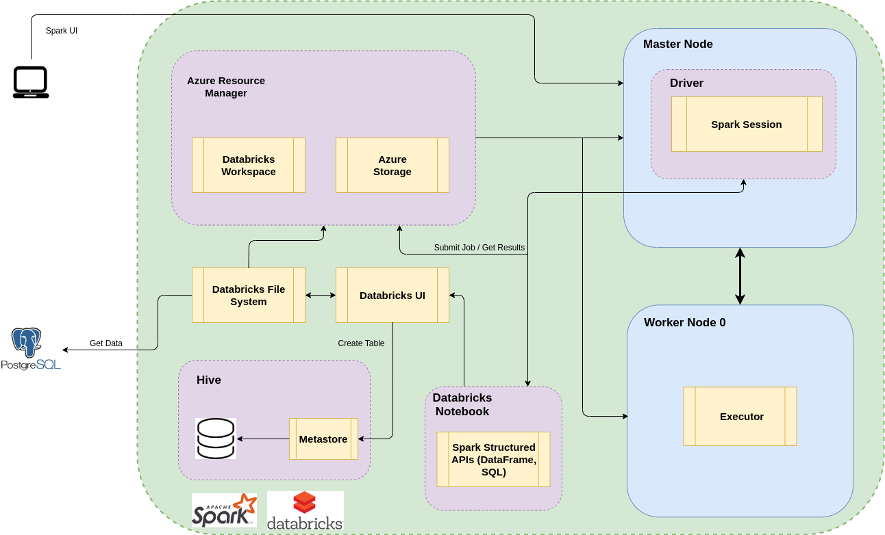

# Spark

## Table of Contents
- [Introduction](#Introduction)
- [Spark on Zeppelin and Hadoop](#Spark-on-Zeppelin-and-Hadoop)
- [Azure Databricks](#Azure-Databricks)
- [Improvements](#Improvements)

## Introduction
The [Data Analytics with Pandas/Jupyter PoC project](https://github.com/jarviscanada/jarvis_data_eng_AndresOsorio/tree/master/python_data_wrangling)
was a success; it provided valuable customer insights that helped London Gift Shop
(LGS) develop targeted marketing strategies and drive their revenue back up;
therefore, LGS wanted to invest more money into applying the same data analysis 
procedure across the entire organization. However, Python Pandas can only process
data on a single machine, which makes it inefficient for large datasets; the
Data Analytics team then decided to explore Apache Spark as a solution, as it
allows parallel processing of large amounts of data on a cluster. As a Data Engineer,
I was tasked with:

- Evaluating Spark using Zeppelin Notebook running on Hadoop
- Evaluating Spark using Databricks running on Azure
- Re-implementing the Data Analytics 
[Jupyter Notebook](https://github.com/jarviscanada/jarvis_data_eng_AndresOsorio/tree/master/python_data_wrangling/retail_data_analytics_wrangling.ipynb) using Azure
Databricks

For the Zeppelin/Hadoop evaluation, I reused the same Hadoop environment and 
dataset from the [Hadoop project](https://github.com/jarviscanada/jarvis_data_eng_AndresOsorio/tree/master/hadoop) (a 3-node cluster on GCP Dataproc
and the 2016 World Development Indicators dataset, respectively); however, I used
Spark SQL and DataFrames (Spark Structured APIs) on the Zeppelin notebook to analyze
the data instead of HiveQL.
For the Databricks/Azure analysis, I re-implemented the
[Jupyter Notebook](https://github.com/jarviscanada/jarvis_data_eng_AndresOsorio/tree/master/python_data_wrangling/retail_data_analytics_wrangling.ipynb) from the 
[Data Analytics with Pandas/Jupyter PoC project](https://github.com/jarviscanada/jarvis_data_eng_AndresOsorio/tree/master/python_data_wrangling) using
Azure Databricks, which is an Apache Spark-based analytics platform optimized for the
Microsoft Azure cloud services.

## Spark on Zeppelin and Hadoop 
I reused the same Hadoop environment and 
dataset from the [Hadoop project](https://github.com/jarviscanada/jarvis_data_eng_AndresOsorio/tree/master/hadoop) (a 3-node cluster on GCP Dataproc
and the 2016 World Development Indicators dataset, respectively).
The WDI dataset originally resides on GCP Storage; I loaded the data onto the Hadoop
cluster and created a Hive table from it in PARQUET format for optimization purposes;
Hive doesn't store the actual data; it holds metadata in its Metastore (table schema,
HDFS location, SerDe, etc.) and uses it to represent data in the underlying 
Distributed File System as database objects/tables. I then used the SparkSQL and
PySpark interpreters on the Zeppelin notebook to explore Spark functionality and
performance through data analytics operations on the WDI dataset. 

### **Architecture:**

### **Notebook:**

## Azure Databricks 
I re-implemented the
[Jupyter Notebook](https://github.com/jarviscanada/jarvis_data_eng_AndresOsorio/tree/master/python_data_wrangling/retail_data_analytics_wrangling.ipynb) from the 
[Data Analytics with Pandas/Jupyter PoC project](https://github.com/jarviscanada/jarvis_data_eng_AndresOsorio/tree/master/python_data_wrangling) using
Azure Databricks, which is an Apache Spark-based analytics platform optimized for the
Microsoft Azure cloud services. The dataset was LGS transactional data from 2009-12 to
2012-12; it was downloaded as a CSV file from a data warehouse (PostgreSQL instance)
and loaded onto the Databricks File System (DBFS) - DBFS is an abstraction on top
of the Databricks cluster and scalable object storage that lets you access
and interact with the underlying storage (Azure Storage, S3, HDFS, etc.) seamlessly
as a Distributed File System - Once the data was loaded on the
DBFS, a table was registered from it using Databricks UI - By default, Spark 
uses a Hive Metastore with a Derby database to work with database objects/tables -
I then used SparkSQL and
PySpark (Spark Structured APIs) to re-implement the same data analytics process that
was applied on the 
[Jupyter Notebook](https://github.com/jarviscanada/jarvis_data_eng_AndresOsorio/tree/master/python_data_wrangling/retail_data_analytics_wrangling.ipynb);
that is, I performed parallel data analysis on a cluster to answer several business
questions, divide customers into segments, and identify important segments to help
LGS develop targeted marketing strategies. 

### **Architecture:**

### **Notebook:**
[Jupyter Notebook version](./notebooks/Retail_Data_Analytics_with_PySpark.ipynb)

## Improvements
- Explore Spark DataSet Structured API, as well
- Explore Spark's functionality to evaluate other types of data from the client
  organization (Spark Streaming, MLib, GraphX)
- Implement the project with Scala, since it is Spark's native language
- Evaluate Spark on other environments for comparison (AWS, stand-alone cluster
  manager with external storage, etc.)