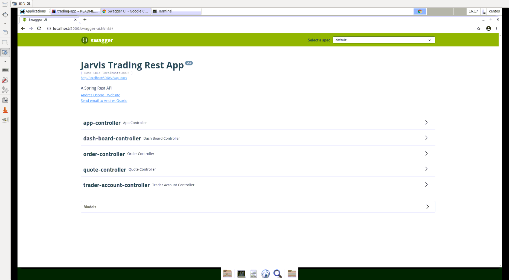

# Trading App
## Table of contents
* [Introduction](#Introduction)
* [Quick Start](#Quick-Start)
* [Architecture](#Architecture)
* [REST API Usage](#REST API Usage)
* [Docker Deployment](#Docker Deployment)
* [Improvements](#Improvements)

## Introduction
- This program is an online stock trading simulation REST API; it retrieves stock market information
    and persists it into a databse; this information can then be used to CRUD quote, trader and order
    data from and to the databse. This API can be consumed by front-end and mobile developers, as
    well as traders.
- This project is a PoC and therefore focuses on functionality rather than 
    performance and security, which is why IEX Cloud is used as the stock information
    data source (IEX Cloud has delayed stock information). The application is implemented
    as a microservice using SpringBoot (to manage dependencies), PSQL (to persist and CRUD data using DAO) 
    and IEX market data; it also falls under the MVC and 3-tier architecture - it has a client tier 
    (HTTP clients to consume API), an application tier (SpringBoot Java program which processes data) 
    and a database tier (where data is persisted).

## Quick Start
- **Pre-requisites:** Docker (17.05 or higher), any linux distro
- **Docker scripts:**
  - **Build images:**
    ```bash
    # psql image - make sure you are in the psql directory
    docker build -t traading-psql .
    # app image - make sure you are in the root directory
    docker build -t trading-app .
    ```
  - **Create docker network:**
    ```bash
    # create a network to communicate between both containers
    docker network create --driver bridge trading-net
    ```
  - **Start containers:**
    ```bash
    # start the psql container from the trading-psql image and attach it to the trading-net network
    docker run --name trading-psql-dev \
    -e POSTGRES_PASSWORD=password \
    -e POSTGRES_USER=postgres \
    --network trading-net \
    -d -p 5432:5432 trading-psql
    
    # start the app container from the trading-app image and attach it to the trading-net network
    # token = token form your IEX account
    docker run --name trading-app-dev \
    -e "PSQL_URL=jdbc:postgresql://trading-psql-dev:5432/jrvstrading" \
    -e "PSQL_USER=postgres" \
    -e "PSQL_PASSWORD=password" \
    -e "token=${token}" \
    --network trading-net \
    -p 5000:5000 trading-app
    ```
  - **Pull images:**
    ```bash
    # you can also pull the images from Docker Hub and run the same commands above
    docker pull onehoax/trading-psql
    docker pull onehoax/trading-app
    ```
- **SwaggerUI:**
   

## Architecture

- **Controller layer:** takes HTTP requests and calls the service layer with appropriate input (handles HTTP requests using Tomcat);
      it also intercepts exceptions thrown by the app (in lower layers) and maps them to logical
      HTTP status codes
- **Service layer:** handles business logic; validates data passed down from controller layer
      and calls corresponding functionality in the DAO layer
- **DAO layer:** performs CRUD operations on the database and IEX system using the DAO data access pattern
- **SpringBoot:** manages application dependencies automatically through IoC; Apache
      Tomcat is the default web-servlet in SpringBoot: it provides a pure Java HTTP web server environment to handle client HTTP requests
- **PSQL and IEX:** IEX cloud is used as the stock market data source and PSQL as the database
      to persist application data

## REST API Usage
### Swagger
Swagger is a set of open-source tools built around the OpenAPI Specification that can help you design, build, document and consume REST APIs.
Swagger is then a perfect fit for this project because it enables developers to automatically generate a UI and an API JSON file
for this RESTful API app; the UI makes it easy for users to consume the API (lists all controllers with their end-points and corresponding documentation) and the API JSON file
(describes the structure of the API) makes it easy for developers to test the API on HTTP clients (e.g. postman).
### Quote Controller
- This controller handles HTTP requests that CRUD stock quotes to and from IEX Cloud and the PSQL instance;
    stock marker data is retrieved from the IEX Cloud and persisted in the PSQL instance;
    stock quote data in the database can then be used to CRUD trader and order data to and from the PSQL instance
- Endpoints:
  - **GET `/quote/dailyList`:** lists all securities that are available for trading in this trading system (quotes persisted in the PSQL instance from IEX Cloud)
  - **GET `/quote/iex/ticker/{ticker}`:** gets security quote from IEX Cloud for the ticker specified
  - **POST `/quote/tickerId/{tickerId}`:** gets security quote from IEX Cloud corresponding to tickerId; if quote is already in the database then it updates it with 
        the new data from IEX, otherwise it creates it
  - **PUT `/quote/`:** adds/updates quote in the database manually (without IEX data); quote object is specified in the request body
  - **PUT `/quote/iexMarketData`:** updates all quotes in the database using IEX Could as the data source
### Trader Controller
- This controller handles Http requests that CRUD trader data to and from the PSQL instance (manages trader and account data)
- Endpoints:
  - **POST `/trader/`:** creates a trader and a corresponding account; traderId and accountId are auto-generated by the database, and they should be identical - we are assuming each trader has exactly one account;
        quote object is specified in the request body
  - **POST `/trader/firstname/{firstname}/lastname/{lastname}/dob/{dob}/country/{country}/email/{email}`:**
        same as `/trader/`, except that the trader object is passed in the URL instead of the request body
  - **PUT `/trader/deposit/traderId/{traderId}/amount/{amount}`:**
        deposits funds to an account that is associated with the given traderId; amount must be > 0
  - **PUT `/trader/withdraw/traderId/{traderId}/amount/{amount}`:**
        withdraws funds from an account that is associated with the given traderId; amount must be > 0 and <= existing account amount 
  - **DELETE `/trader/traderId/{traderId}`:** deletes a trader IFF its account amount is 0 and has no open positions; also deletes the associated account and security orders  
### Order Controller
- This controller handles HTTP requests that Create security order data in the PSQL instance (creates market orders for the account specified)
- Endpoints:
  - **POST `/order/marketOrder`:** submits a market order corresponding to the account specified and creates a security order entry in the database; market order object is specified in the request body
### Dash-board controller
- This controller handles HTTP requests that Read trader data from the PSQL instance
- Endpoints:
  - **GET `/dashboard/profile/traderId/{traderId}`:** shows trader and account details
  - **GET `/dashboard/portfolio/traderId/{traderId}`:** shows all positions that have been filled that correspond to the traderId specified
### App controller
- This controller handles an HTTP request that inquires whether the app is working normally
- Endpoints:
  - **GET `/health`:** shows whether the app is working normally

## Docker Deployment
  
  - **Dockerfiles:**
    ```bash
    ##### PSQL Dockerfile ##### 
    # all scripts placed under `/docker-entrypoint-initdb.d/` are run when the container is started;
    # these scripts initialize the database, user and tables needed
    FROM postgres:9.6-alpine
    COPY init_db.sql schema.sql /docker-entrypoint-initdb.d/  
    ```
    ```bash
    ##### App Dockerfile ##### 
    # Build stage: compiles source code using maven
    FROM maven:3.6-jdk-8-slim AS build
    COPY src /build/src
    COPY pom.xml /build/
    RUN mvn -f /build/pom.xml clean package -DskipTests
    
    # Package stage: runs the app from the fat jar produced by the `Build stage`
    FROM openjdk:8-alpine
    COPY --from=build /build/target/trading-1.0-SNAPSHOT.jar /usr/local/app/trading/lib/trading_app.jar
    ENTRYPOINT ["java","-jar","/usr/local/app/trading/lib/trading_app.jar"]
    ```
  - **Build images:**
    ```bash
    # psql image - make sure you are in the psql directory
    docker build -t traading-psql .
    # app image - make sure you are in the root directory
    docker build -t trading-app .
    ```
  - **Create docker network:**
    ```bash
    # create a network to communicate between both containers
    docker network create --driver bridge trading-net
    ```
  - **Start containers:**
    ```bash
    # start the psql container from the trading-psql image and attach it to the trading-net network
    docker run --name trading-psql-dev \
    -e POSTGRES_PASSWORD=password \
    -e POSTGRES_USER=postgres \
    --network trading-net \
    -d -p 5432:5432 trading-psql
    
    # start the app container from the trading-app image and attach it to the trading-net network
    # token=token form your IEX account
    docker run --name trading-app-dev \
    -e "PSQL_URL=jdbc:postgresql://trading-psql-dev:5432/jrvstrading" \
    -e "PSQL_USER=postgres" \
    -e "PSQL_PASSWORD=password" \
    -e "token=${token}" \
    --network trading-net \
    -p 5000:5000 trading-app
    ```
  - **Pull images:**
    ```bash
    # you can also pull the images from Docker Hub and run the same commands above
    docker pull onehoax/trading-psql
    docker pull onehoax/trading-app
    ```

## Improvements
- Better understanding of security trading in general for a more accurate representation and implementation
- More precise definition and implementation of market orders
- More Unit testing using Mockito (most testing was Integration testing)
- Widen the app coverage by using more IEX API endpoints and manipulating that data appropriately
- Improve code efficiency by better understanding SpringBoot, DAO, Swagger and Java 8